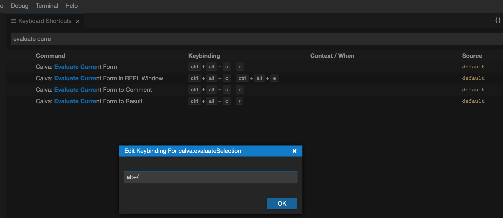

## Getting comfortable with editor:

### Setting up keybinding:
 
 - Open `File` > `Settings` > `Open Keyboard Shortcuts`.
 - Search for "Evaluate Current Form".
 - Update the keybinding - (you have to type each character of) `alt+/` as shown below.

### Evaluating in REPL:

Throughout the course, we'll be using nREPL to evaluate the snippets.

To connect to nREPL,

- Click on the `nREPL` icon at the bottom toolbar.
- On the list of options opened at the top click on `..(a.k.a. Jack-in)`.
- Wait for it to load.
- Now you'll be able to open any source file in the form of `*.clj` and place your cursor on the starting parenthesis `(` or ending parenthesis `(` of the expression that you have to evalute and give `alt` +`/` to evaluate.
